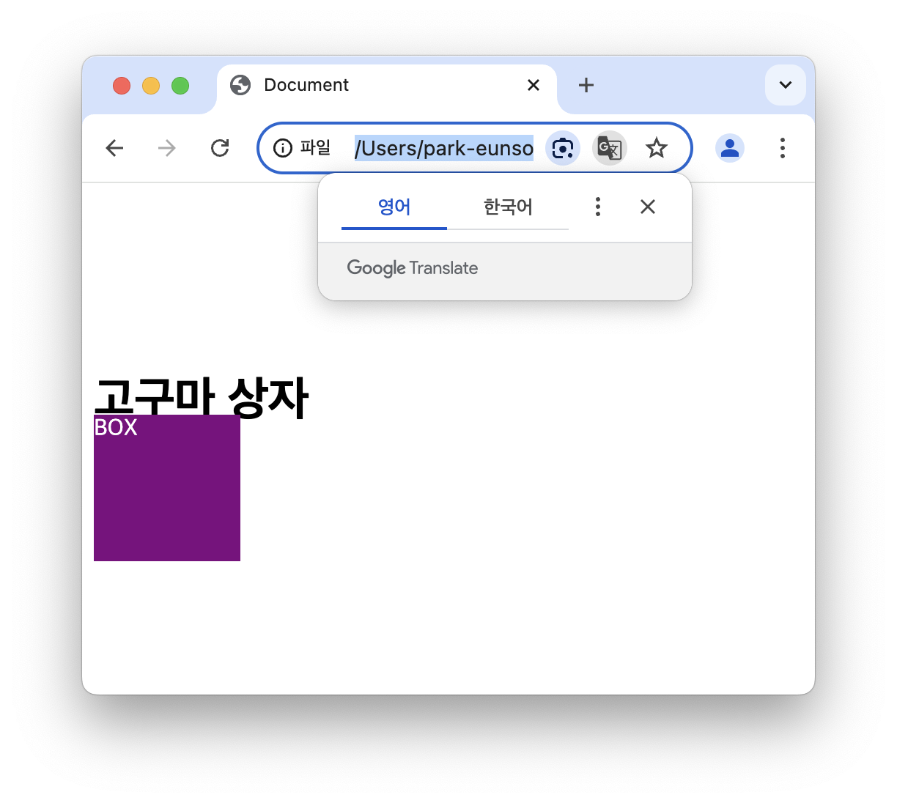

chapter 00 - HTML

- 시맨틱 태그란?
    
    먼저 시맨틱 태그(Semantic Tag)는 포함된 콘텐츠의 특정 의미를 정의하고 목적을 갖는 태그입니다. 기존 HTML에서 제공되는 <div> 태그의 기능으로, block element (하나의 태그가 브라우저에서 좌우공간을 모두 차지하며, 독립적인 공간을 가지는 요소) 이면서, 사이트의 구조를 설계하기 위해 제공됩니다. 이는 콘텐츠를 논리적인 섹션으로 구성하고, 각 섹션의 역할과 기능을 전달을 용이하게 합니다.
    
    즉, 시맨틱 태그란 각 태그에 의미를 부여하여 웹사이트의 구조를 파악하기 쉽게 만듭니다.
    
    시맨틱 태그의 기본적인 규칙
    
    1. 콘텐츠의 의미와 기능에 따라 적합한 요소를 사용한다.
    2. 요소들을 명확한 계층 구조와 구조를 형성할 수 있도록 올바르게 중첩해야 한다.
        
        요소를 적절한 위치에 배치하여 상호 관계를 명확하게 하여야 합니다.
        
        ex ) 페이지의 주요 콘텐츠를 통틀어 묶으려면 <main> 태그를 사용해야 하나, 페이지를 여러 하위 주제나 제목과 같은 목록을 생성하기 위해선 <section> 태그를 이용하여야 한다.
        
    3. 의미 없는 요소나 속성을 사용하지 않아야 한다.
    
    시맨틱 태그의 장점
    
    1. 접근성 향상
    2. 검색엔진최적화(SEO) 향상
    3. 가독성 향상
    
    - div 태그로만 페이지를 구조화 하는 것이 좋은가? 🍠
        
        <div> 태그는 레이아웃 생성하거나 콘텐츠를 나누는 컨테이너로서 사용합니다. 대부분의 HTML 태그들은 각 태그 고유의 의미를 가지고 있으나, <div> 태그는 오직 컨테이너로서 본질적으로 어떠한 의미도 없습니다. 따라서, 의미가 있는 태그를 사용할 수 없는 상황에서만 이용하게 됩니다. 즉, 시맨틱 태그의 기본 규칙 - 의미 없는 요소나 속성을 사용하지 않아야 한다는 약속을 어기기 때문에 <div> 태그로만 페이지를 구조화하는 것은 올바르지 못하다고 생각합니다.
        

        
    - 기타 태그 추가 정리해보기 🍠
        `header` : 문서 / 페이지의 머릿글 지정하는 태그 (상단에 위치)                                                        
        `main` : 웹사이트나 텍스트의 본문이나 콘텐츠                                                               
        `mark` : 형광펜으로 밑줄 그은 효과를 주며, 중요한 내용을 강조시키는 태그          
        `figcaption` : <figure> 태그의 자식 태그로, <figure> 태그를 부가 설명할 때 사용

    - **`Sementic Tag`**를 잘 활용하였을 때 장점은? 🍠
    1. 접근성 향상
    2. 검색엔진최적화(SEO) 향상
    3. 가독성 향상

    inline element 와 같이 한 줄에 다른 요소들과 같이 배치되고, inline element 에선 불가능했던 width/height, margin/padding 속성의 상하 간격 조정이 가능해집니다.

    즉, 내부적으로는 block element 의 규칙을 따르고 외부적으로 inline element 의 규칙을 따릅니다.

    inline-block element 의 대표적인 예시
    1. button
    2. input    
    3. select

    
    위 사진처럼 block 은 크기와 줄바꿈, 여백이 모두 적용이 됩니다.
    하지만 inline 요소는 여백은 좌우로만, 크기와 줄바꿈은 모두 적용되지 않습니다.
    inline-block 요소는 block의 요소와 비슷하게 크기와 여백이 모두 적용되지만, inline 처럼 줄바꿈이 적용되지 않습니다.

chapter 00 - CSS

- border vs outline의 차이점 🍠
    
    border 는 박스 모델의 일부로서, 요소의 레이아웃에 영향을 주는 반면에,                                        
    outline 은 요소의 테두리 바깥에 있는 선입니다.
    
    1. 두 박스 사이즈 모두 10
/Users/park-eunsol/8th_Web/keyword/chapter00/두 박스 사이즈 border 10.png
    2. border 를 5만큼 줄였을 때
/Users/park-eunsol/8th_Web/keyword/chapter00/border 5.png
    3. outline 을 5만큼 줄였을 때
/Users/park-eunsol/8th_Web/keyword/chapter00/outline 5.png

- 고구마 상자 옮기기 예제
- 코드를 첨부해주세요 🍠
    ```html
    <!DOCTYPE html>
    <html lang="en">
    
    <head>
      <meta charset="UTF-8">
      <meta name="viewport" content="width=device-width, initial-scale=1.0">
      <title>Document</title>
      <style>
        .box {
          width: 100px;
          height: 100px;
          background-color: purple;
          color: white;
          box-sizing: border-box;
          position: relative;
          top: 150px;
          left: 0px;
        }
      </style>
    </head>
    
    <body>
      <div class="box">BOX</div>
      <h1>고구마 상자</h1>
    </body>
    
    </html>
    ```



- **`position: absolute`**를 활용하여 본인의 힘으로, 아래와 같은 이미지로 BOX2를 이동시켜보세요! 🍠
    
    
    
### 코드는 아래에 첨부해주세요!
```html
<!DOCTYPE html>
<html lang="en">

<head>
  <meta charset="UTF-8">
  <meta name="viewport" content="width=device-width, initial-scale=1.0">
  <title>Document</title>
  <style>
    * {
      margin: 0;
      box-sizing: border-box;
    }

    .box1 {
      width: 500px;
      height: 500px;
      background-color: purple;
      color: white;
      position: relative;
    }

    .box2 {
      width: 200px;
      height: 200px;
      background-color: yellow;
      position: absolute;
      top: 0px;
      left: 0px;
    }
  </style>
</head>

<body>
  <div class="box1">BOX1</div>
  <h1 class="box2">BOX2</h1>
</body>

</html>
```

### 키워드 정리 🍠

- text-align
    
    텍스트의 수평 정렬을 설정하기 위해 사용합니다. 이 속성을 사용할 때는 left, right, center, justify 의 값을 설정해 줄 수 있습니다.

    실습 예제) HTML 코드
    <!DOCTYPE html>
    <html lang="en">
    <head>
        <meta charset="UTF-8">
        <meta name="viewport" content="width=device-width, initial-scale=1.0">
        <link rel = "stylesheet" href="style.css">
        <title> chichi </title>
    </head>
    <body>
        <h1 color : purple> CHICHI </h1>
    </body>
    </html>

    실습 예제) CSS 코드

    @charset "uft-8";

    h1 {
        border: 5px;
        text-align: center;
    }
    
- margin
    
    마진은 현재 요소 주변의 여백 공간을 의미합니다. 마진을 조절하여 현재 요소와 다른 요소들 간의 공간을 조절할 수 있습니다.
    
    margin 속성에는 top, bottom, left, right 가 존재하고,
    
    1. margin-top : 상단의 마진 영역 조절
    2. margin-bottom : 하단의 마진 영역 조절
    3. margin-left : 왼쪽 마진 영역 조절
    4. margin-right : 오른쪽 마진 영역 조절
    
    을 의미하므로, 특정 부분의 위치 조정을 원한다면 속성을 붙여서 사용합니다.
    
    margin의 속성값에 대해서는 값, 백분율, auto가 있습니다.
    
    1. 값 : 단위를 직접 지정
    2. 백분율 : 부모 요소를 기준으로 백분율 지정
    3. auto : 브라우저 및 요소의 크기에 따라 적절하게 자동 조절

    실습 예제) HTML 코드
    ```html
    <!DOCTYPE html>
    <html lang="en">
    <head>
        <meta charset="UTF-8">
        <meta name="viewport" content="width=device-width, initial-scale=1.0">
        <link rel = "stylesheet" href="style.css">
        <title> chichi </title>
    </head>
    <body>
        <div class = "container"> 
            <div class = "child"></div>
    </div>
    </body>
    </html>
    ``````

    실습 예제) CSS 코드
    ```css
    
    @charset "uft-8";

    .container {
        margin : 25px;
        width : 350px;
        height : 200px;
        outline : dashed 1px purple;
    }

    .child {
        width : 50px;
        height : 50px;
        background-color :aquamarine;
        margin : 0 auto;
    }
    ```

- flex
    
    flex 는 레이아웃 배치 전용 기능을 합니다. 이는 flexible box, flexbox 라고 표현하기도 합니다.
    
    flex 를 사용하기 위해선 부모 요소에 필수적으로 적용해야 하는 속성이 있습니다.
    
    1. `display : flex;` flex의 레이아웃을 적용
    2. `flex-direction : (방향);` 내부 요소들의 정렬 방향

    실습 예제) HTML 코드
```html
    <!DOCTYPE html>
    <html lang="en">
    <head>
        <meta charset="UTF-8">
        <meta name="viewport" content="width=device-width, initial-scale=1.0">
        <link rel = "stylesheet" href="style.css">
        <title> chichi </title>
    </head>
    <body>
        <div class = "container"> 
            <div class = "child"></div>
        </div>
    </body>
    </html>
    ```

    실습 예제) CSS 코드
    ```css

    @charset "uft-8";

.container {
    margin : 25px;
    width : 350px;
    height : 200px;
    outline : dashed 1px purple;
    display : flex;
    justify-content : center;
}

.child {
    width : 50px;
    height : 50px;
    background-color :aqua;
}
```

- translate
    
    translate 는 변형 함수이며, 2차원이나 3창원에서 x, y, z축 방면으로 요소를 이동시킬 때 사용합니다.
    
    1. `transform : translateX(크기);` 해당하는 요소를 x축 방향으로 (크기) 만큼 이동
    2. `transform : translateY(크기);` 해당하는 요소를 y축 방향으로 (크기) 만큼 이동
    3. `transform : translateXY(크기, 크기);` 해당하는 요소를 x, y축 방향으로 (크기, 크기) 만큼 이동
    4. `transform : translateXYZ(크기, 크기, 크기);` 해당하는 요소를 x, y, z축 방향으로 (크기, 크기, 크기) 만큼 이동
    5. `transform : translateZ(크기);` 해당하는 요소를 z축 방향으로 (크기) 만큼 이동
    
    위와 같은 코드를 사용하여 원하는 방면으로 이동시킬 수 있습니다.

    실습 예제) HTML 코드
    ```html

    <!DOCTYPE html>
    <html lang="en">
    <head>
    <meta charset="UTF-8">
    <meta name="viewport" content="width=device-width, initial-scale=1.0">
    <link rel = "stylesheet" href="style.css">
    <title> chichi </title>
    </head>
    <body>
    <div class = "container"> 
    </div>
    </body>
    </html>
    ```

    실습 예제) CSS 코드
    ```css

    @charset "uft-8";

    .container {
    width : 50px;
    height : 50px;
    background-color :blueviolet;
    position: absolute;
    top: 50%;
    left: 50%;
    transform: translate(-50%, -50%);
    }
    ```

- grid
    
    grid 는 flex 와 달리 두 방향 (가로, 세로) 2차원 레이아웃 시스템입니다.
    
    flex 보다 더욱 복합적인 레이아웃을 표현할 수 있습니다.

    실습 예제) HTML 코드

    ```html

    <!DOCTYPE html>
    <html lang="en">
    <head>
    <meta charset="UTF-8">
    <meta name="viewport" content="width=device-width, initial-scale=1.0">
    <link rel = "stylesheet" href="style.css">
    <title> chichi </title>
    </head>
    <body>
    <div class="center">
        <div class="inner"></div>
    </div>
    </body>
    </html>
    ```

실습 예제) CSS 코드
    ```css

    @charset "uft-8";

    .center {
    display: grid;
    place-items: center;
    }

    .inner {
    height: 50px;
    width: 50px;
    background-color: purple;
    }
    ```

- 반응형 background 🍠
    - background-image
        
        `background-image: url("주소");` : url 주소에 있는 이미지를 가져와 삽입할 수 있습니다.            배경 이미지의 경로와 그라디언트를 설정할 수 있습니다.
        
    - background-repeat
        
        `background-repeat : (no-)repeat;` 백그라운드 이미지의 반복 방식을 지정합니다.
        
    - background-position
        
        `background-position : center top;` 백그라운드 이미지의 위치를 조절합니다.
        
    - background-size
        
        div 의 크기에 맞게 백그라운드 이미지의 크기를 조절합니다.
        
        - `background-size : px;` : 이미지의 크기를 고정시킵니다.
        - `background-size : auto;` : 이미지의 비율을 통해 자동으로 다른 축의 크기를 결정합니다.
        - `background-size : %;` : 컨테이너의 넓이에 비례하여 사이즈를 조절합니다.
        - `background-size : contain;` : 컨테이너의 전체를 덮으나 이미지를 자르지 않습니다.
        - `background-size : cover;` : 컨테이너를 완전히 덮습니다. (반응형 X)
    - 축약형
        
        `background : url(”이미지 주소”) no-repeat(반복 여부) center top(위치) / 100%(사이즈);`

- transition 🍠
    
    ### transition  🍠
    
    <aside>
    💡 아래 키워드에 대해 학습한 후, 실습을 진행해주시고, 코드와 실행 영상을 남겨주세요!
    
    </aside>
    
    transition 의 사전적으로 변화, 전이라는 의미를 지닙니다. CSS 에서의 transition은 ‘과도기’ 라는 의미에 가깝습니다. CSS property 의 값이 바뀔 때, 값의 변화가 일정 시간에 걸쳐 일어나도록 합니다.
    
    - transition-property
        
        트랜지션의 대상을 지정
        
    - transition-duration
        
        트랜지션을 실행할 시간을 지정
        
    - transition-timing-function
        
        트랜지션의 실행 형태를 지정
        
    - transition-delay
        
        트랜지션의 지연 시간을 지정
        
    - transition-behavior
        
        개별 속성에 트랜지션을 시작할지 여부를 지정
        
    
    ### 실습  🍠
    
    **`transition`** 키워드를 학습한 후, 해당 키워드와, **`transform에서 배운 특정 키워드를 활용`**하여, 아래와 같은 영상과 비슷하게 만들어주세요! (똑같을 필요는 없고, 기능만 같으면 됩니다.)
    
    단, **`transition 축약형`**을 사용해주세요!

    ```html
    <!DOCTYPE html>
    <html lang="en">
    <head>
    <meta charset="UTF-8">
    <meta name="viewport" content="width=device-width, initial-scale=1.0">
    <link rel = "stylesheet" href="style.css">
    <title> chichi </title>
    </head>
    <body>
    <div class="box1"></div>
    <div class="box2"></div>
    <div class="box3"></div>
    </body>
    </html>
    ```

```css
@charset "uft-8";

.box1 {
    display: block;
    width: 100px;
    height: 100px;
    background-color: #ffcccc;
    transform : rotate(45deg);
    margin : 0 auto;
    position: relative;
    top : 15px;

    -webkit-transition:
        width 2s,
        height 2s,
        background-color 2s,
        -webkit-transform 2s;

    transition:
        width 2s,
        height 2s,
        background-color 2s,
        transform 2s;
    }

    .box1:hover {
    background-color: blueviolet;
    width: 100px;
    height: 100px;
    }


    .box2 {
        display: block;
        width: 100px;
        height: 100px;
        background-color: #ffcccc;
        transform : rotate(45deg);
        margin : 0 auto;
        position: relative;
        top : 55px;
    
        -webkit-transition:
            width 2s,
            height 2s,
            background-color 2s,
            -webkit-transform 2s;
    
        transition:
            width 2s,
            height 2s,
            background-color 2s,
            transform 2s;
        }
    
        .box2:hover {
        background-color: blueviolet;
        width: 100px;
        height: 100px;
        }


        .box3 {
            display: block;
            width: 100px;
            height: 100px;
            background-color: #ffcccc;
            transform : rotate(45deg);
            margin : 0 auto;
            position: relative;
            top : 95px;
        
            -webkit-transition:
                width 2s,
                height 2s,
                background-color 2s,
                -webkit-transform 2s;
        
            transition:
                width 2s,
                height 2s,
                background-color 2s,
                transform 2s;
            }
        
            .box3:hover {
            background-color: blueviolet;
            width: 100px;
            height: 100px;
            }
```

- animation 🍠
    
    ### animation 🍠

    
    - animation-name
        
        @keyframes 의 이름입니다.
        
    - animation-duration
        
        한 싸이클 동안 애니메이션이 얼마에 걸쳐 일어날 지 지정합니다.
        
    - animation-delay
        
        element 가 업로드 되고 난 뒤, 언제 애니메이션이 다시 시작될 지 지정합니다.
        
    - animation-direction
        
        애니메이션이 종료되고, 처음부터 시작할지 역방향으로 시작할지 결정합니다.
        
        ( 정방향 / 역방향 / 번갈아가며 )
        
    - animation-iteration-count
        
        애니메이션이 몇 번 반복될 지 지정합니다. `infinite` 로 지정하여 무한하게 반복이 가능합니다.
        
    - animation-play-state
        
        애니메이션을 멈추거나 다시 시작할 수 있습니다.
        
    - animation-timing-function
        
        상태 전환을 하는 시간 간격을 지정합니다.
        
        ( linear / ease / ease-in / ease-out / ease-in-out / cubic-bezier )
        
    - animation-fill-mode
        
        애니메이션이 시작되기 전이나 끝난 후 어떤 값을 적용할 지 지정합니다.
        
        ( none / forwords / backwords / both )
        
    - @keyframes
        
        개발자가 애니메이션 중간 중간 특정 지점을 거칠 수 있는 키프레임을 설정하여 CSS 애니메이션 과정의 중간 절차를 제어할 수 있게 합니다.
        
        - `from` : 시작이 offset 인 0% 입니다.
        - `to` : 마지막이 offset 인 100% 입니다.
        - `percentage` : 전체 애니메이션의 시간 중 keyframe 이 발생하는 시점의 % 입니다.
     - 축약형

    ```css
    animaition : 
        animaition-name 
        animaition-duration 
        animaition-delay 
        animaition-iteration-count 
        animaition-timing-function 
        animaition-direction 
        animaition-fill-mode play-state;
        

    ex) animation : chichi 4s 1s infinite linear alternate;
    ```

### 실습  🍠

 `animation 키워드`**를 학습한 후, 아래와 비슷한 영상을 만들어주세요!

단, **`animation 축약형`**을 사용해주세요!

- [x]  원은 어떻게 만들까요?
- Hint
    
    **`border-radius` 를 활용해봅시다~!**
    
- [x]  계속 튀기는 애니메이션은 어떻게 하면 쉽게 만들까요?
- Hint
    
`infinte`, `alternate` 속성을 활용해봅시다!
    

```html
<!DOCTYPE html>
<html lang="en">
<head>
    <meta charset="UTF-8">
    <meta name="viewport" content="width=device-width, initial-scale=1.0">
    <link rel = "stylesheet" href="style.css">
    <title> chichi </title>
</head>
<body>
    <div class = "box">
        <div class = "ball"></div>
    </div>
</body>
</html>
```

```css
@charset "uft-8";

.box {
    display: block;
    width: 100px;
    height: 100px;
}

.ball {
    border-radius: 100%;
    position : relative;
    margin: 50px;

    width : 100px;
    height : 100px;
    background-color : purple;

    animation: ball 1s 1s infinite linear alternate;
    transform: translateZ(200px);

    }

    @keyframes ball {
        0% {
            transform: translateY(0px);
            width : 90px;
        }
        100% {
            transform: translateY(200px);
            width : 110px;
        }
    }
```

chapter00 - JS

- JS에서 사칙연산을 하는 방법을 작성해주세요. 🍠
    - 더하기
        
        ```jsx
        console.log(a + b);
        ```
        
    - 빼기
        
        ```jsx
        console.log(a - b);
        ```
        
    - 곱하기
        
        ```jsx
        console.log(a * b);
        ```
        
    - 나누기
        
        ```jsx
        console.log(a / b);
        ```
        
    - 나머지 구하기
        
        ```jsx
        console.log(a % b);
        ```
        
    - 거듭 제곱
        
        ```jsx
        console.log(a ** b);
        ```
        
- JS에서 비교 연산을 하는 여러가지 방법을 조사하여 정리해주세요. 🍠
    
    JS 에서의 비교 연산 또한, 평소에 사용하던 C/C++ 과 같이 부등호와 등호를 이용합니다.
    
    - a 가 b 보다 작을/클 때
        
        `a < b`, `a > b`
        
    - a 가 b 보다 작거나/크거나 같을 때
        
        `a <= b`, `a >=b`
        
    - a 와 b 가 동등(같을)할 때
        
        `a == b` a = b로 표기하지 않는다. 이는 대입 연산자이며, 전혀 다른 의미를 가집니다.
        
    - a 와 b 가 같지 않을 때
        
        `a != b`
        
- JS에서 증가/감소 연산을 하는 여러가지 방법을 조사하여 정리해주세요. 🍠
    
    증감연산자란, 변수의 값을 “1” 만큼만 증가/감소 시키는 연산자로 총 2가지 종류가 있습니다.
    
    1. 증가연산자 (Increment)
        
        먼저 증가연산자란, 값을 1씩 점점 증가시키는 연산자로,                                                         변수 x에 대하여 `x++` 로 표기하여 사용합니다.
        
        ```jsx
        let x = 1;
        x++;
        console.log(x); //출력값 : 2
        ```
        
    2. 감소연산자 (Decrement)
        
        먼저 감소연산자란, 값을 1씩 점점 감소시키는 연산자로,                                                         변수 x에 대하여 `x--` 로 표기하여 사용합니다.
        
        ```jsx
        let x = 2;
        x--;
        console.log(x); //출력값 : 1
        ```
        
    
    이러한 증감 연산자는 `x = x + 1` 또는 `x = x - 1` 과 같이 풀어 쓸 수 있습니다.
    
    증감연산자에선, 연산자의 위치에 따라서 2가지 종류의 연산자로 한 번 더 구분합니다.
    
    1. 전위연산자 (Prefix operator)
        
        전위연산자란, 변수보다 연산자가 앞에 위치하는 것으로, `++x` 로 표기한다.                           전위연산자는 연산자를 먼저 수행한 후 변수에 할당하기 때문이다.
        
        ```jsx
        let x = 2;
        let y = ++x;
        console.log(x, y); //출력값 : 3, 3
        ```
        
    2. 후위연산자 (Postfix operator)
        
        후위연산자란, 변수보다 연산자가 뒤에 위치하는 것으로, `x++` 로 표기한다.                           후위연산자는 변수에 먼저 값을 할당한 후 연산을 수행하기 때문이다.
        
        ```jsx
        let x = 2;
        let y = x++;
        console.log(x, y); //출력값 : 3, 2
        ```

    
- 연산자 우선순위에 대해 작성해주세요. 🍠

/Users/park-eunsol/8th_Web/keyword/chapter00/연산자 우선순위 표.png


### string

<aside>
💡 JS에서의 ‘string’ 이란, 문자열을 의미하며, 텍스트 데이터를 나타내는 자료형입니다.

</aside>

문자열은 작은따옴표 (’) 와 큰따옴표 (”) 를 이용하여 문자를 감싼 형태로 사용합니다.                                   따옴표의 종류는 일관되게 사용하는 것이 좋습니다.                                                                                 문자열의 길이는 0이거나 1 이상의 길이를 가질 수 있습니다.                                                              JS에서는 문자가 하나이든 여러개이든 모두 문자열 자료형으로 취급합니다.

문자열을 사용할 때, 따옴표의 순서가 중요합니다.

```jsx
"내부에 '작은 따옴표'를 사용할려면, 외부에는 큰 따옴표를 사용합니다"
'내부에 "큰 따옴표를 사용할려면, 외부에는 큰 작은 따옴표를 사용합니다'
```

또한 출력물에 따옴표들을 출력하고 싶을 때, 역슬래시/이스케이프 문자(₩, \) 를 이용합니다.

### bigint

<aside>
💡 Bigint 는 임의의 정밀도로 정수를 나타낼 수 있는 JS 의 새로운 숫자 데이터형입니다.

</aside>

BigInt를 사용하면 숫자에 대한 안전한 정수 제한을 초과하여 큰 정수를 안전하게 저장하고 조작할 수 있습니다.

Bigint 타입의 특징

1. overflow 없이 정수 연산을 올바르게 수행할 수 있습니다.
2. 데이터를 숫자 값으로 표현할 수 있습니다.
3. BigDecimal 구현의 기초를 형성해낼 수 있습니다.

- 다양한 `Array method`에 대해 정리해주세요. 🍠
    - sort 🍠
        
        배열의 원소를 알파벳 순서나 지정해준 순서대로 정렬합니다.
        
    - join 🍠
        
        배열의 원소 전부를 하나의 문자열로 합칩니다.
        
    - reverse 🍠
        
        배열의 원소 순서를 거꾸로 만듭니다.
        
    - splice 🍠
        
        배열의 특정 위치에 요소를 추가하거나 삭제할 수 있습니다.
        
        ```tsx
        splice (index, 제거할 요소의 개수, 배열에 추가될 요소)
        ```
        
    - slice 🍠
        
        배열의 시작 인덱스부터 끝나는 인덱스 까지에 대한 shallow copy 를 새로운 배열 객체로 반환합니다.
        
    - find 🍠
        
        주어진 조건에 맞는 배열의 첫 번째 요소를 반환하며, 조건에 맞는 요소가 없으면 `undefined` 를 반환합니다.
        
    - filter 🍠
        
        지정된 함수 결과값을 true로 만드는 새로운 배열을 생성하여 반환합니다.
        
    - map 🍠
        
        배열의 각 원소별로 지정된 함수를 실행한 결과로 구성된 새로운 배열을 반환합니다.
        
    - reduce 🍠
        
        누산기(accumulator)와 배열의 각 값(좌에서 우로)에 대해 (누산된) 한 값으로 줄도록 함수를 적용합니다.
        
    - some  🍠
        
        지정된 함수의 결과가 true일 때까지 배열의 각 원소를 반복합니다.
        
    - every 🍠
        
        배열의 모든 요소가 제공한 함수를 통과하는지 테스트합니다.
        
    - forEach 🍠
        
        배열의 각 원소별로 지정된 함수를 실행합니다. (반환값 X)

### 호이스팅 (Hoisting) 🍠

<aside>
💡 JS 에서의 호이스팅은, interpreter 가 변수와 함수의 메모리 공간을 변수와 함수 선언 이전에 미리 할당해 주는 것을 의미합니다.

</aside>

- getter 🍠
    
    getter는 객체의 속성값을 반환하는 method 입니다.
    
- setter 🍠
    
    setter는 객체의 속성값을 변경하고 설정하는 method 입니다.

```JS
class Student {
	constructor(name, school) {
		this.name = name;
		this.school = school;
	}
	
	getName() {
		return this.name;
	}

	setName(name) {
		this.name = name;
	}

	getSchool() {
		return this.school;
	}

	setSchool(school) {
		this.school = school;
	}
	
	introduction() {
		console.log(`안녕하세요, ${this.name}입니다. ${this.school}에 다니고 있습니다.`);
	}
}

const student = new Student('박은솔', '인하대학교');

student.introduction();

student.setName('치치');
student.setSchool('UMC대학교');

student.introduction();
```

DOM 조작

- 태그 가져오기
    
    ```tsx
    요소명.getElementByTagName("태그명"); 
    ```
    
- 이벤트 리스너 추가하기
    
    ```tsx
    변수.on(이벤트명) = function();
    요소.addEventListener("이벤트명", 함수명);
    ```
    
    위와 같이 두 가지 방식으로 이벤트 리스너를 추가할 수 있습니다.
    
- 이벤트 리스너 제거하기
    
    ```tsx
    element.removeEventListener("이벤트명", 함수명);
    ```
    
- 키보드와 마우스 이벤트
    
    키보드 이벤트
    
    1. keypress : 키를 눌렀을 때
    2. keydown : 키를 누르는 동안
    3. keyup : 키에서 손을 뗄 때
    
    마우스 이벤트 (5, 6, 7 번은 터치스크린에서 동작하지 않습니다.)
    
    1. click : 마우스를 눌렀을 때
    2. dbclick : 마우스를 더블 클릭했을 때
    3. mousedown : 마우스를 누르고 있는 동안
    4. mouseup : 마우스에서 손을 뗄 때
    5. mouseover : 마우스를 요소 위로 움직였을 때
    6. mousemove : 마우스를 움직일 때
    7. mouseout : 마우스를 요소 밖으로 움직였을 때
- 태그 속성 다루기
    1. `요소명.getAtrribute(’속성명’);` : 속성에 접근하는 코드
    2. `요소명.setAtrribute(’속성명’, '값');` : 속성을 수정하는 코드
    3. `요소명.removeAtrribute(’속성명’);` : 속성을 제거하는 코드
- 부모와 자식 태그 찾기
    
    DOM 은 node 계층으로 이루어져 있습니다. 따라서 부모와 자식 태그에 접근할 때 node 를 통해 접근하여야 합니다. 
    
    node 의 부모, 형제, 자식은
    
    부모 노드 : `parentNode`,                                                                                                                         자식 노드 : `childNodes` (첫 번째 자식 접근 : `firstChild`, 마지막 자식 접근: `lastChild`),                                  형제 노드 : 같은 레벨의 노드 중, 이전 노드 리턴`previousSibling`, 다음 노드 리턴`nextSibling`
    
    ```tsx
    const parentNode = list.parentNode; //이와 같이 사용하여 노드를 호출할 수 있다.
    ```
    
    노드를 통해 부모, 자식, 형제에 접근했다면 요소를 탐색할 수 있습니다.
    
    부모 요소 탐색 : `parentElement`
    
    자식 요소 탐색 : `children`                                                                                                                   (첫 번째 자식 접근 : `firstElementChild`, 마지막 자식 접근 : `lastElementChild`)
    
    형제 요소 탐색 : 같은 레벨의 노드 중,                                                                                                        이전 요소 리턴`previousElementSibling`, 다음 요소 리턴`nextElementSibling`
    
- 새로운 태그 만들기
    1. createXXX 으로 태그 생성하기
        
        복잡하고, 작성 비용이 고가이지만 체계적인 작성이 가능합니다.
        
        - `createElement(노드명)` : 태그 생성
        - `createTextNode(텍스트)` : 텍스트 생성
        - `createAttribute(속성명)` : 속성 생성
        - `createComment(텍스트)` : 주석 생성
        
        위 명령어들로 생성한 노드를 트리에 삽입하여야 합니다.
        
        ```tsx
        변수명.appendChild(노드명); //선택한 노드의 가장 마지막에 삽입됩니다.
        ```
        
    2. innerHTML 로 태그 생성하기
        
        쉽고, 작성 비용이 저렴하지만 모든 것을 문자열로 조작하기 때문에 복잡한 작업은 어려움이 있습니다.
        
        ```tsx
        변수명.innerHTML = '<input type="text" size="10">';
        
        if <p> 태그를 생성할 시,
        변수명.innerHTML += '<p align="center"> 치치입니다 </p>';
        와 같이 추가하여 사용할 수 있습니다.
        ```
        
- 태그 복제하기
    
    ```
    var duplicationNode = node.cloneNode(deep);
    ```
    
    여기서 deep 이란, 파라미터입니다.
    
    deep 의 자리에 true 를 작성할 시 요소의 하위 요소까지 모두 복사할 수 있습니다.
    
    false 를 작성할 시 요소의 하위 요소를 제외하고 복사할 수 있습니다.